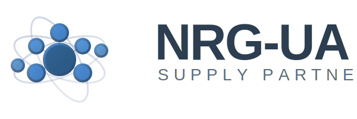

# Оновлення логотипу NRG-UA

## ✅ Що було зроблено

Замінено старий простий логотип на новий професійний дизайн з молекулярною структурою та текстом "NRG-UA SUPPLY PARTNER".

### Файли логотипів:

1. **images/nrg-logo.svg** - Основний логотип (600x200px)
   - Молекулярна структура з градієнтами
   - Текст "NRG-UA" великими літерами
   - Текст "SUPPLY PARTNER" меншими літерами
   - Анімовані елементи (пульсація центрального атома)

2. **images/favicon.svg** - Іконка для браузера (64x64px)
   - Спрощена версія молекулярної структури
   - Оптимізована для малих розмірів

### Оновлені файли:

#### HTML файли:
- ✅ nrg-index.html
- ✅ pages/nrg-about.html
- ✅ pages/nrg-brands.html
- ✅ pages/nrg-catalog.html
- ✅ pages/nrg-contacts.html
- ✅ pages/nrg-news.html
- ✅ pages/partners.html

#### CSS файли:
- ✅ css/nrg-style.css - додано стилі для `.logo-image`

### Зміни в коді:

**Було (старий логотип):**
```html
<a href="/" class="logo">
    <span class="logo-icon">
        <svg width="40" height="40">...</svg>
    </span>
    <span class="logo-text">NRG-UA</span>
</a>
```

**Стало (новий логотип):**
```html
<a href="/" class="logo">
    
</a>
```

## Адаптивність

Логотип автоматично масштабується на різних пристроях:
- 🖥️ Desktop: 50px висота
- 💻 Tablet (макс. 1024px): 40px висота
- 📱 Mobile (макс. 768px): 35px висота

## CSS стилі

```css
.logo-image {
    height: 50px;
    width: auto;
    display: block;
    transition: transform var(--transition-base);
}

.logo-image:hover {
    transform: scale(1.05);
}
```

## Особливості дизайну

### Кольори:
- Синій градієнт: #4A90E2 → #2E5C8A → #1E3A5F
- Орбіти: #8B9DC3 / #B0BACC (напівпрозорі)
- Текст "NRG-UA": #2C3E50
- Текст "SUPPLY PARTNER": #5D6D7E

### Ефекти:
- Плавна анімація пульсації центрального атома
- Hover ефект масштабування (105%)
- Градієнтні переходи для об'ємності

## Перевірка

Переконайтеся, що логотип правильно відображається:
1. Відкрийте nrg-index.html у браузері
2. Перевірте header (верхня частина сторінки)
3. Перевірте footer (нижня частина сторінки)
4. Перевірте інші сторінки (about, brands, catalog, тощо)
5. Перевірте на різних розмірах екрану (адаптивність)

## Troubleshooting

### Проблема: Логотип не відображається
**Рішення:** Перевірте, що файли знаходяться у правильній папці:
- `d:\energy\images\nrg-logo.svg`
- `d:\energy\images\favicon.svg`

### Проблема: Логотип занадто великий/малий
**Рішення:** Змініть значення `height` в HTML або оновіть CSS медіа-запити

### Проблема: Логотип не масштабується на мобільних
**Рішення:** Перевірте CSS файл `css/nrg-style.css` на наявність медіа-запитів

## Формат файлів

Обидва логотипи у форматі SVG, що забезпечує:
- ✅ Високу якість на будь-якому розмірі екрану
- ✅ Малий розмір файлу
- ✅ Швидке завантаження
- ✅ Підтримку анімацій
- ✅ Можливість зміни кольорів через CSS (якщо потрібно)

## Наступні кроки

Якщо потрібно внести зміни:
1. Відредагуйте файл `images/nrg-logo.svg` в текстовому редакторі або векторному редакторі (Adobe Illustrator, Inkscape)
2. Збережіть зміни
3. Оновіть сторінку у браузері (Ctrl+F5 для скидання кешу)

---

Створено: 21 травня 2026 року
Статус: ✅ Готово до використання
